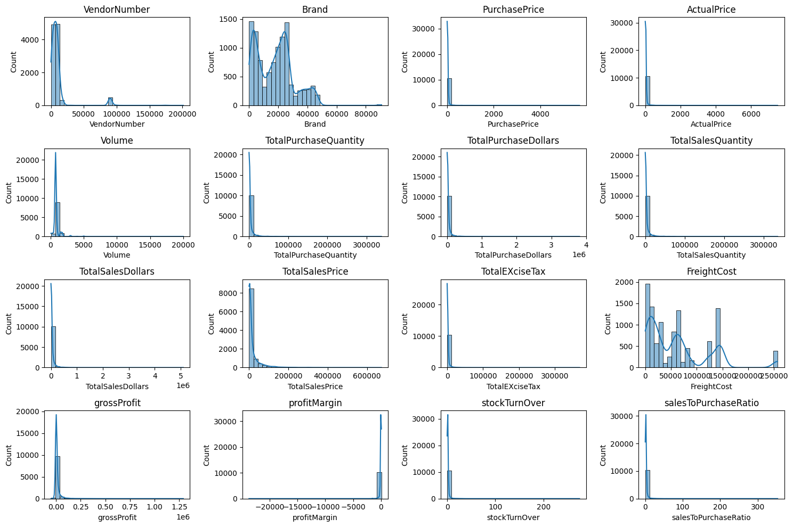
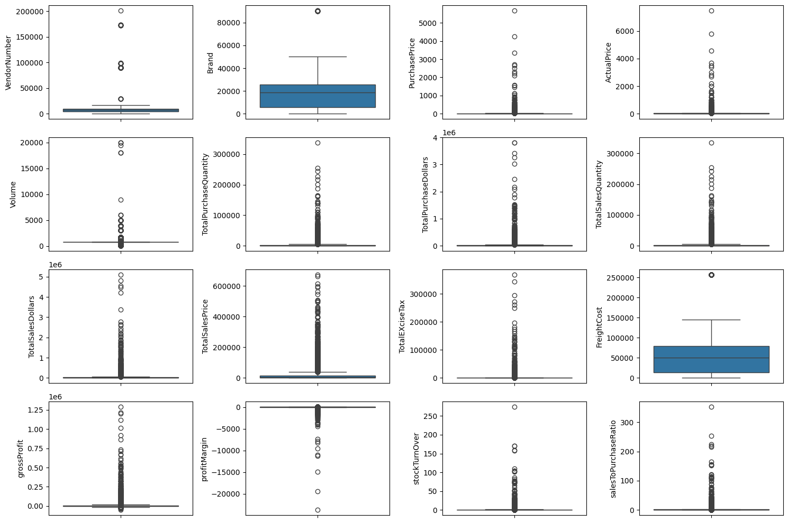
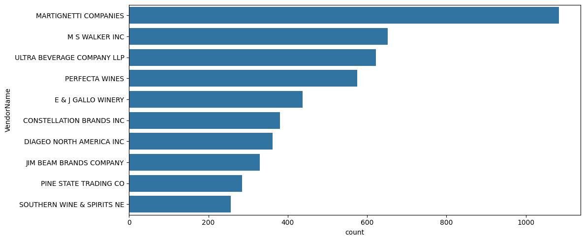
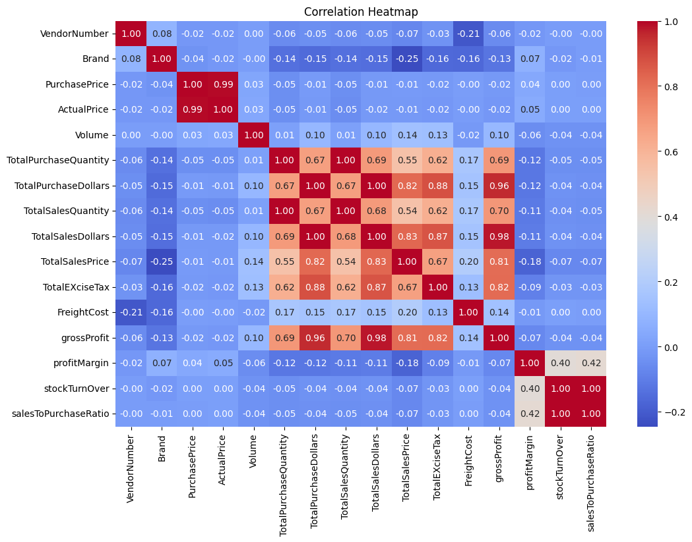
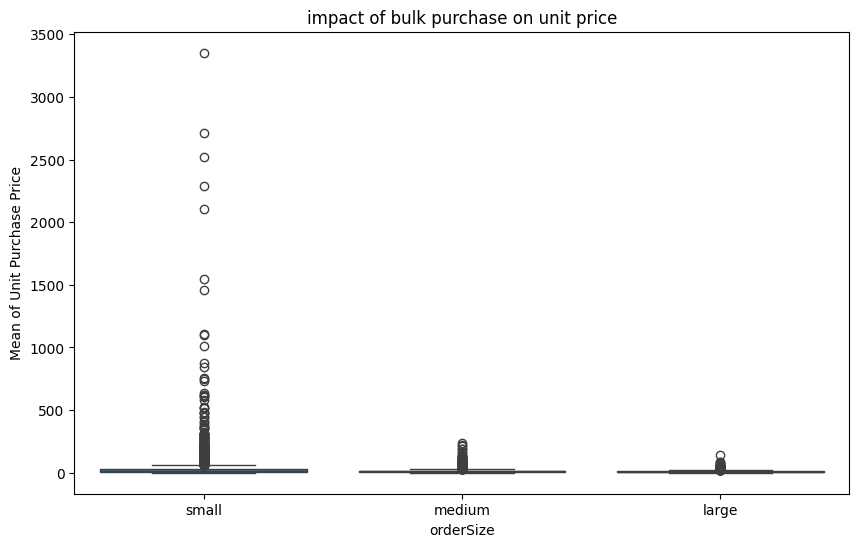
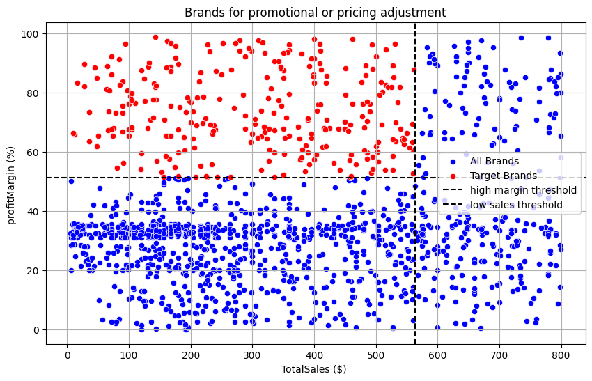

# Vendor Performance Analysis

An end-to-end analytics project evaluating vendor and brand performance for a retail/beverage business — covering **automated data ingestion (Python + SQLAlchemy)**, **exploratory data analysis (Pandas, Matplotlib, Seaborn)**, **SQL-based business analysis**, and an **interactive Power BI dashboard**.

## Overview

This project analyzes purchase, sales, and vendor invoice data to answer: where is procurement concentrated, where is capital getting locked in unsold stock, does bulk buying actually reduce cost, and which brands are underperforming relative to their profitability. The pipeline covers ingestion + logging, EDA and data-quality cleanup, a merged `vendor_sales_summary` analytical table, SQL business questions, and a stakeholder-facing dashboard.

## Project Workflow

```
Raw CSVs (vendor_invoice, purchases, purchase_prices, sales_price)
        │
        ▼
Ingestion  →  ingestion_db.py
  • reads every CSV in data/, loads into SQLite (inventory.db)
  • logs each step to logs/ingestion_db.log
        │
        ▼
Vendor Summary Build  →  get_vendor_summary.py
  • SQL joins purchases + sales + freight into one vendor/brand view
  • derives grossProfit, profitMargin, stockTurnOver, salesToPurchaseRatio
  • writes the merged result back as vendor_sales_summary
        │
        ▼
EDA & Business Analysis  →  vendor performance analysis.ipynb / Exploratory Data Analysis.ipynb
  • distribution & outlier checks, correlation analysis
  • vendor concentration, bulk-pricing impact, brand targeting, inventory lock-up
        │
        ▼
Interactive Dashboard  →  PowerBI Dashboard/vendorPerformanceDASHBoard.pbix
```

## Repo Structure

| File | Purpose |
|---|---|
| `ingestion_db.py` | Reads raw CSVs and loads them into SQLite, with logging |
| `optimize_insertion.py` | Reusable helper for fast, chunked DataFrame → SQLite inserts |
| `get_vendor_summary.py` | SQL join across purchases/sales/freight tables + derived KPI columns |
| `vendor performance analysis.ipynb` | Main EDA + business-question analysis (source of the charts below) |
| `Exploratory Data Analysis.ipynb` | Earlier-stage exploratory pass |
| `VendorPerformance.ipynb` | Ingestion scratch notebook |
| `dataset/` | Expects raw CSVs locally (see `linkOfData.txt` for source — not committed due to size) |
| `logs/` | Ingestion run logs |
| `PowerBI Dashboard/vendorPerformanceDASHBoard.pbix` | Interactive dashboard for stakeholders |

## Data Cleaning & Feature Engineering

- Merged four raw tables (`purchases`, `purchase_prices`, `sales_price`, `vendor_invoice`) into one `vendor_sales_summary` view via SQL joins in `get_vendor_summary.py`.
- Standardized `VendorName` (stripped whitespace) and cast `Volume` to float.
- Derived KPIs: `grossProfit` (sales − purchase $), `profitMargin` (%), `stockTurnOver` (sales qty / purchase qty), `salesToPurchaseRatio`.
- Checked distributions and outliers across all numeric columns before drawing conclusions (see below).

## Findings

**1. Purchase-related fields are heavily right-skewed with extreme outliers**
Most numeric columns (`TotalPurchaseDollars`, `TotalSalesDollars`, `FreightCost`, etc.) are dominated by a small number of very large vendors/orders, visible both in the distribution plots and the outlier boxplots — this is why later analysis uses medians and quantile bucketing rather than raw means in places.




**2. A small number of vendors account for most transaction volume**
Martignetti Companies alone accounts for noticeably more line-item transactions than any other vendor, with the next tier (M S Walker, Ultra Beverage, Perfecta Wines) clustered well below it — an early signal of vendor concentration explored further in the SQL layer.



**3. Unit price barely moves revenue — but purchase and sales quantity move in lockstep**
The correlation heatmap shows `TotalPurchaseQuantity` and `TotalSalesQuantity` correlate almost perfectly (~1.0), and `grossProfit` tracks `TotalSalesDollars` closely (0.98) — but `PurchasePrice`/`ActualPrice` show essentially no correlation with revenue or profit. In other words, how much moves through a vendor matters far more than what it's priced at.



**4. Bulk purchasing measurably reduces unit price**
Vendors were bucketed into small/medium/large order sizes via quantile binning. The small-order group shows a long tail of high-price outliers that all but disappears for medium and large orders — confirming bulk-pricing strategy meaningfully lowers unit cost.



**5. A specific set of brands are under-marketed relative to their profitability**
Using a threshold split (bottom slice of total sales, top slice of profit margin), a distinct cluster of "target brands" emerges — high margin but low sales volume — flagged as candidates for promotional or pricing attention.



## Tech Stack

- **Python**: Pandas, NumPy, Matplotlib, Seaborn, SQLAlchemy, logging
- **SQL / SQLite** for the merged vendor summary and business-question queries
- **Power BI** for the stakeholder-facing dashboard

## How to Run

```bash
git clone https://github.com/nayak-siddarth/vendor-performance-analysis.git
cd vendor-performance-analysis
pip install pandas numpy matplotlib seaborn sqlalchemy

# 1. Place raw CSVs in a data/ folder (see dataset/linkOfData.txt for source)
# 2. Ingest into SQLite
python ingestion_db.py

# 3. Build the merged vendor_sales_summary table
python get_vendor_summary.py

# 4. Reproduce the EDA / business analysis
jupyter nbconvert --to notebook --execute "vendor performance analysis.ipynb"
```

Open `PowerBI Dashboard/vendorPerformanceDASHBoard.pbix` in Power BI Desktop to explore the dashboard.

## Future Improvements

1. Add ML-based vendor scoring (composite risk/performance score)
2. Add anomaly detection for unusual purchase or pricing patterns
3. Integrate a live database connection instead of static CSV ingestion

## License

See [LICENSE](./LICENSE).
